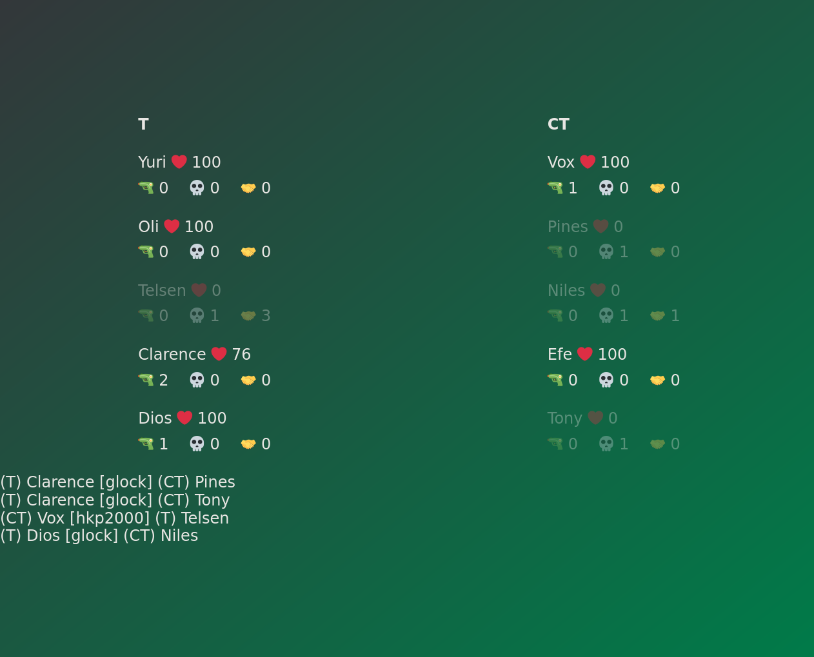

# csgsi

A tiny experiment in building a custom HUD for CS2 matches using
[Counter-Strike game state integration](https://developer.valvesoftware.com/wiki/Counter-Strike:_Global_Offensive_Game_State_Integration)
and [Source engine logging](https://developer.valvesoftware.com/wiki/HL_Log_Standard)
using Yew.



## Running

```console
$ nix build
$ RUST_LOG=info CSGSI_ASSET_DIR=./result/share/html ./result/bin/csgsi_be
```

In `<steam directory>/steamapps/common/Counter-Strike Global Offensive/game/csgo/cfg`, add a `gamestate_integration_csgsi.cfg` with the following:

```
"Console Sample v.1"
{
 "uri" "http://127.0.0.1:3000/gsi"
 "timeout" "5.0"
 "buffer"  "0.5"
 "throttle" "2.0"
 "heartbeat" "60.0"
 "auth"
 {
   "token" "CCWJu64ZV3JHDT8hZc"
 }
 "output"
 {
   "precision_time" "3"
   "precision_position" "1"
   "precision_vector" "3"
 }
 "data"
 {
   "provider"            "1"
   "map"                 "1"
   "round"               "1"
   "player_id"           "1"
   "allplayers_id"       "1"      // Same as 'player_id' but for all players. 'allplayers' versions are only valid for HLTV and observers
   "player_state"        "1"
   "allplayers_state"    "1"
   "allplayers_match_stats"  "1"
   "allplayers_weapons"  "1"
   "allplayers_position" "1"      // output the player world positions, only valid for GOTV or spectators.
   "phase_countdowns"    "1"      // countdowns of each second remaining for game phases, eg round time left, time until bomb explode, freezetime. Only valid for GOTV or spectators.
   "allgrenades"    "1"           // output information about all grenades and inferno flames in the world, only valid for GOTV or spectators.
 }
}
```

At runtime, execute the following in CS2 dev console:

```
log 1
logaddress_add "http://127.0.0.1:3000/log"
```

Visit http://localhost:3000
